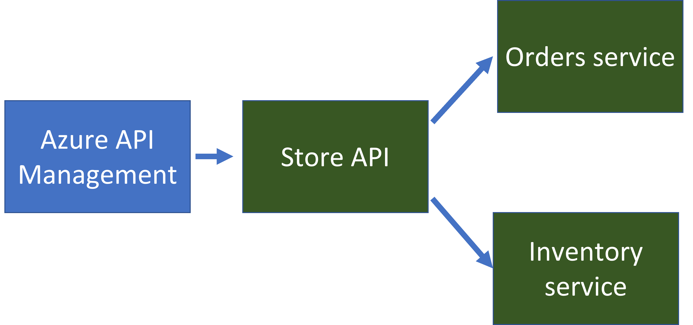

# Container App Store Microservice Sample

This is a sample microservice solution for Azure Container Apps.  It will create a store microservice which will need to call into an order service and an inventory service.  Dapr is used to secure communication and calls between services, and Azure API Management and Azure Cosmos DB are created alongside the microservices.

The entire solution is configured with [GitHub Actions](https://github.com/features/actions) and [Bicep](https://docs.microsoft.com/azure/azure-resource-manager/bicep/overview) for CI/CD.

IMPORTANT: In general, each microservice should have an independent release and deployment. For the sake of this sample we are building and deploying as part of a single repo.  

- [Deploy](#deploy)
- [Solution Overview](#solution-overview)
- [Build and run](#build-and-run)

## Deploy

1. Fork the sample repo
2. Create the following required [encrypted secrets](https://docs.github.com/en/actions/security-guides/encrypted-secrets#creating-encrypted-secrets-for-an-environment) for the sample

  | Name | Value |
  | ---- | ----- |
  | AZURE_CREDENTIALS | The JSON credentials for an Azure subscription. [Learn more](https://docs.microsoft.com/azure/developer/github/connect-from-azure?tabs=azure-portal%2Cwindows#create-a-service-principal-and-add-it-as-a-github-secret) |
  | RESOURCE_GROUP | The name of the resource group to create |
  | PACKAGES_TOKEN | A GitHub personal access token with the `packages:read` scope. [Learn more](https://docs.github.com/en/authentication/keeping-your-account-and-data-secure/creating-a-personal-access-token) |

3. Open the GitHub Actions, select the **Build and Deploy** action and choose to run the workflow.  
  
    This will start the GitHub Actions which will build the code, publish them to your GitHub repository as private container images, create an Azure Container App environment, a Cosmos DB database, and Container Apps for each of the microservices.
4. Once the GitHub Actions have completed successfully, navigate to the [Azure Portal](https://portal.azure.com) and select the resource group you created.  Open the `node-app` container, and browse to the URL.  You should see the sample application running.  You can navigate to the `/orders?id=foo` endpoint and `/inventory?id=foo` to test the microservices.

## Solution Overview

  

There are three main microservices in the solution.  

#### Store API (`node-service`)
The [`node-service`](./node-service) is an express.js API that exposes three endpoints.  `/` will return the primary index page, `/order` will return details on an order (retrieved from the **order service**), and `/inventory` will return details on an inventory item (retrieved from the **inventory service**).

#### Order Service (`python-service`)
The [`python-service`](./python-service) is a Python flask app that will retrieve and store the state of orders.  It uses [Dapr state management](https://docs.dapr.io/developing-applications/building-blocks/state-management/state-management-overview/) to store the state of the orders.  When deployed in Container Apps, Dapr is configured to point to an Azure Cosmos DB to back the state. 

#### Inventory Service (`go-service`)
The ['go-service'](./go-service) is a Go mux app that will retrieve and store the state of inventory.  For this sample, the mux app just returns back a static value.

## Build and Run

- [Option 1: Build and run with GitHub Codespaces (recommended)](#option-1-build-and-run-with-github-codespaces-recommended)
- [Option 2: Build and run with VS Code Remote Containers](#option-2-build-and-run-with-vs-code-remote-containers)
- [Option 3: Build and run manually](#option-3-build-and-run-manually)

### Option 1: Build and run with GitHub Codespaces (recommended)

#### Pre-requisites
- A GitHub account with access to [GitHub Codespaces](https://github.com/features/codespaces)

### Option 2: Build and run with VS Code Remote Containers

#### Pre-requisites
- Docker
- VS Code with the [remote containers](https://marketplace.visualstudio.com/items?itemName=ms-vscode-remote.remote-containers) extension installed

### Option 3: Build and run manually

#### Pre-requisites
- Docker
- Node 14
- Go 1.17
- Python 3.9
- Dapr 1.4

#### Steps

1. Fork the sample repo
2. Clone the repo: `git clone https://github.com/{username}/container-app-demo`
3. Build the sample: `make init`

